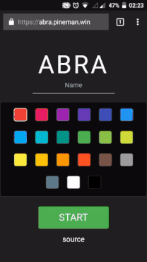
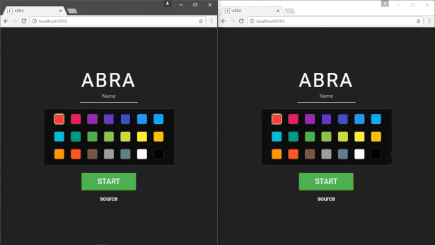

# ABRA
[](https://david-dm.org/pineman/abra)
[](https://david-dm.org/pineman/abra?type=dev)

### Catch you the abra for much win!
ABRA (yes, like the pokémon) is an online browser typing race game.
[You can play it here](https://abra.pineman.win).

Here's what it looks like:

| Mobile                                                    | Desktop                                                            |
| --------------------------------------------------------- | ------------------------------------------------------------------ |
| [](https://abra.pineman.win) | [](https://abra.pineman.win) |

made with :heart: in [Lisbon](https://en.wikipedia.org/wiki/Lisbon)

## Server Installation
```
git clone https://github.com/pineman/abra && cd abra
npm install
make -C client
npm test
```

To run in a more production-y environment with nginx:
```
make -C client deploy
```
nginx conf file and systemd service file are provided in server/config.

## TODO
 * Different error color when cursor is red
 * Prevent players in a room having the same color
 * Save user name
 * npm all the things!
   * `abra-server`
   * `abra-client`
   * `abra-client-http`
   * `abra-client-cli`

## Ideas
 * CLI client using [blessed](https://github.com/chjj/blessed)
 * Post game chat
 * Room links
 * More stats
 * Autoscroll to visible span
 * Guarantee all sockets start at the same time
 * Sound
 * Submit texts
 * Private rooms
 * Leaderboard
 * Abra stats page or similar (all time words typed, etc.)
 * Text chooser (also language)
 * Various game modes
 * More? Accounts?
